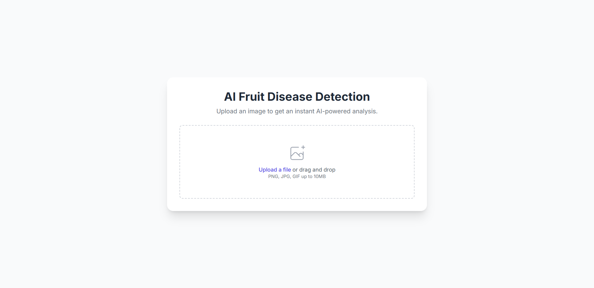
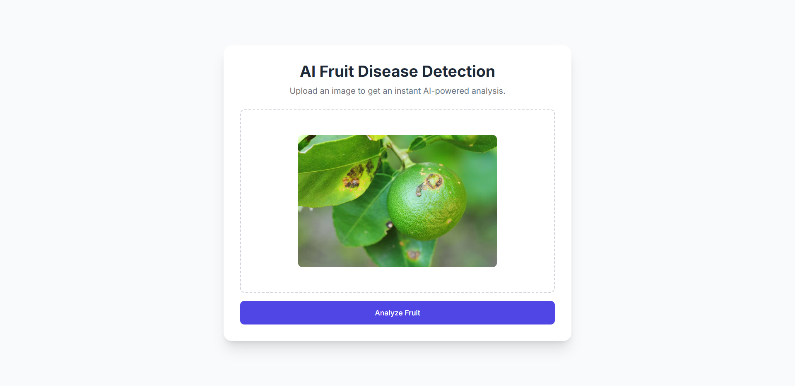
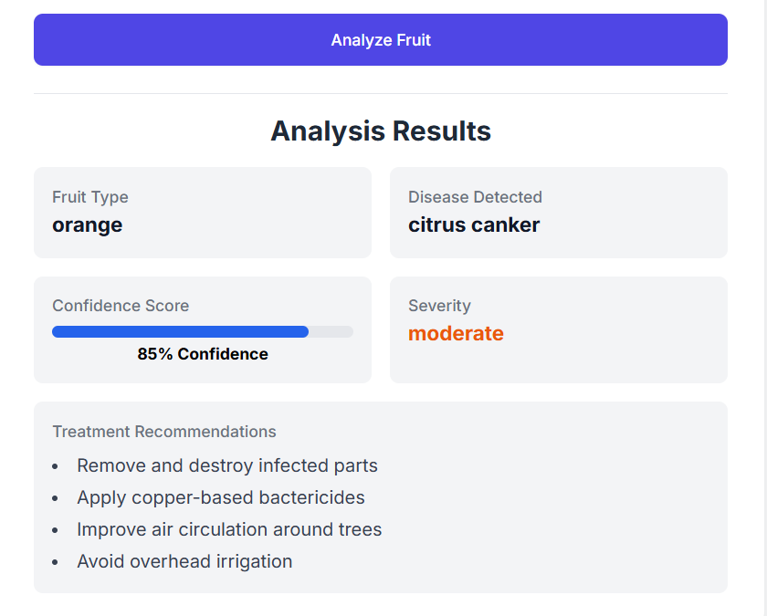
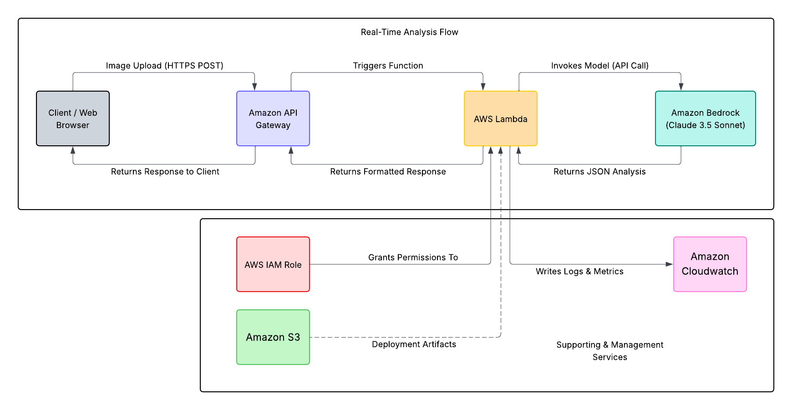

# AI-Powered Fruit Disease Detection

[](https://aws.amazon.com/serverless/)
[](https://opensource.org/licenses/MIT)
[](https://www.python.org/)
[](https://aws.amazon.com/serverless/sam/)

This repository contains the complete backend and deployment scripts for an AI-powered application designed to solve a practical agricultural problem: the rapid and accurate detection of fruit diseases. It showcases a modern, event-driven, and cost-effective serverless architecture on AWS.

---

## Table of Contents
- [Key Features](#key-features)
- [Live Demo & Examples](#live-demo--examples)
- [System Architecture](#system-architecture)
- [Getting Started](#getting-started)
  - [Prerequisites](#prerequisites)
  - [Deployment](#deployment)
- [Usage](#usage)
- [Project Structure](#project-structure)
- [Future Enhancements](#future-enhancements)

## Key Features

- **AI-Powered Analysis:** Uses Amazon Bedrock with the Claude 3.5 Sonnet model for state-of-the-art image recognition.
- **Serverless Backend:** No servers to manage. The application runs on-demand, ensuring high availability and cost-efficiency.
- **Scalable by Design:** Built with API Gateway and Lambda, the system automatically scales to handle any amount of traffic.
- **Infrastructure as Code (IaC):** All AWS resources are defined in a `template.yaml` file and deployed automatically with AWS SAM, ensuring consistent and repeatable environments.
- **Secure by Default:** Follows the Principle of Least Privilege with a fine-grained IAM role for the Lambda function.

## Live Demo & Examples

This project includes both a user-friendly web interface for easy demonstration and a command-line script for testing the backend API directly.

**1. Web Interface Demo**

The primary way to interact with the application is through the simple web UI. A user can upload an image and receive the analysis in seconds.




**2. API Testing**

The backend API can also be tested directly from the command line after deployment:

**Example Request:**
```bash
./test_api.sh path/to/the/fruit_image.jpg
```

**Example Successful Response::**



## System Architecture
The application follows a classic serverless, event-driven pattern. The architecture is designed for low latency, high scalability, and minimal operational overhead.



## Getting Started
Follow these instructions to deploy the application in your own AWS account.

### Prerequisites
- [AWS CLI](https://aws.amazon.com/cli/) configured with your credentials.
- [AWS SAM](https://aws.amazon.com/serverless/sam/) CLI installed.
- [Python](https://www.python.org/downloads/) 3.9+ installed.
- [Docker](https://www.docker.com/products/docker-desktop/) installed and running.

### Deployment
1. Clone the repository:
```bash 
git clone https://github.com/AYassin01/aws-serverless-fruit-detection.git
cd aws-serverless-fruit-detection
```
2. Enable Model Access:
- Navigate to the Amazon Bedrock console in your AWS account.
- Go to Model access and ensure you have been granted access to Anthropic's Claude 3.5 Sonnet.

3. Run the deployment script:
- The deploy.sh script automates the entire process, including creating the Boto3 layer, building the application, and deploying the AWS resources.
```bash
chmod +x deploy.sh
./deploy.sh
``` 
- Follow the prompts from the SAM CLI. This will create a CloudFormation stack and deploy all the necessary resources.

## Usage
After a successful deployment, the 'deploy.sh' script will create a 'test_api.sh' script for you.

1. Make the test script executable:
```bash
chmod +x test_api.sh
```
2. Run the script with the path to a fruit image:
```bash
./test_api.sh path/to/the/fruit_image.jpg
```

## Project Structure
The repository is organized to separate application code from deployment configuration.

```
├── images/
├── src/
│   └── lambda_function.py
├── .gitattributes
├── .gitignore
├── create_boto3_layer.sh
├── deploy.sh
├── index.html
├── LICENSE
├── README.md
├── samconfig.toml
├── template.yaml
└── test_api.sh
 ```

 ## Future Enhancements
- CI/CD Pipeline: Implement a CI/CD pipeline using GitHub Actions to automatically deploy changes pushed to the main branch.
- Asynchronous Processing: For very large images or videos, refactor the architecture to use S3 event notifications and an SQS queue for asynchronous processing.
